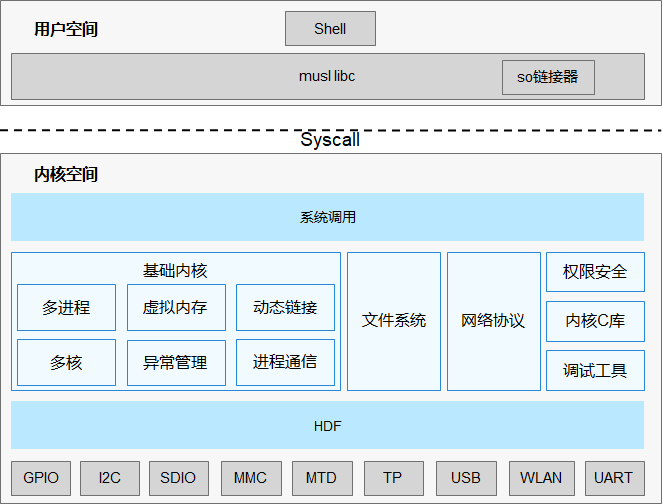

# LiteOS-A内核<a name="ZH-CN_TOPIC_0000001096612501"></a>

-   [简介](#section11660541593)
-   [目录](#section161941989596)
-   [约束](#section119744591305)
-   [使用说明](#section741617511812)
    -   [准备](#section1579912573329)
    -   [获取源码](#section11443189655)
    -   [编译构建](#section2081013992812)

-   [相关仓](#section1371113476307)

## 简介<a name="section11660541593"></a>

OpenHarmony LiteOS-A内核是基于Huawei LiteOS内核演进发展的新一代内核，Huawei LiteOS是面向IoT领域构建的轻量级物联网操作系统。在IoT产业高速发展的潮流中，OpenHarmony LiteOS-A内核能够带给用户小体积、低功耗、高性能的体验以及统一开放的生态系统能力，新增了丰富的内核机制、更加全面的POSIX标准接口以及统一驱动框架**HDF**（OpenHarmony Driver Foundation）等，为设备厂商提供了更统一的接入方式，为OpenHarmony的应用开发者提供了更友好的开发体验。图1为OpenHarmony LiteOS-A内核架构图：

**图 1**  OpenHarmony LiteOS-A内核架构图<a name="fig27311582210"></a>  


## 目录<a name="section161941989596"></a>

```
/kernel/liteos_a
├── apps                   # 用户态的init和shell应用程序
├── arch                   # 体系架构的目录，如arm等
│   └── arm                # arm架构代码
├── bsd                    # freebsd相关的驱动和适配层模块代码引入，例如USB等
├── compat                 # 内核接口兼容性目录
│   └── posix              # posix相关接口
├── drivers                # 内核驱动
│   └── char               # 字符设备
│       ├── mem            # 访问物理IO设备驱动
│       ├── quickstart     # 系统快速启动接口目录
│       ├── random         # 随机数设备驱动
│       └── video          # framebuffer驱动框架
├── fs                     # 文件系统模块，主要来源于NuttX开源项目
│   ├── fat                # fat文件系统
│   ├── jffs2              # jffs2文件系统
│   ├── include            # 对外暴露头文件存放目录
│   ├── nfs                # nfs文件系统
│   ├── proc               # proc文件系统
│   ├── ramfs              # ramfs文件系统
│   └── vfs                # vfs层
├── kernel                 # 进程、内存、IPC等模块
│   ├── base               # 基础内核，包括调度、内存等模块
│   ├── common             # 内核通用组件
│   ├── extended           # 扩展内核，包括动态加载、vdso、liteipc等模块
│   ├── include            # 对外暴露头文件存放目录
│   └── user               # 加载init进程
├── lib                    # 内核的lib库
├── net                    # 网络模块，主要来源于lwip开源项目
├── platform               # 支持不同的芯片平台代码，如Hi3516DV300等
│   ├── hw                 # 时钟与中断相关逻辑代码
│   ├── include            # 对外暴露头文件存放目录
│   └── uart               # 串口相关逻辑代码
├── platform               # 支持不同的芯片平台代码，如Hi3516DV300等
├── security               # 安全特性相关的代码，包括进程权限管理和虚拟id映射管理
├── syscall                # 系统调用
└── tools                  # 构建工具及相关配置和代码
```

## 约束<a name="section119744591305"></a>

-   开发语言：C/C++；
-   适用于Hi3518EV300、Hi3516DV300单板；
-   Hi3518EV300默认使用jffs2文件系统，Hi3516DV300默认使用FAT文件系统。

## 使用说明<a name="section741617511812"></a>

OpenHarmony LiteOS-A内核支持Hi3518EV300（[介绍](https://gitee.com/openharmony/docs/blob/master/zh-cn/device-dev/quick-start/oem_minitinier_des_3518.md)）、Hi3516DV300（[介绍](https://gitee.com/openharmony/docs/blob/master/zh-cn/device-dev/quick-start/oem_minitinier_des_3516.md)）单板，开发者可基于两种单板开发运行自己的应用程序。

### 准备<a name="section1579912573329"></a>

开发者需要在Linux上搭建编译环境：

-   [Ubuntu编译环境准备](https://gitee.com/openharmony/docs/blob/master/zh-cn/device-dev/quick-start/quickstart-lite-env-setup-linux.md);
-   Hi3518EV300单板：参考[环境搭建](https://gitee.com/openharmony/docs/blob/master/zh-cn/device-dev/quick-start/quickstart-lite-steps-hi3518-setting.md)；
-   Hi3516DV300单板：参考[环境搭建](https://gitee.com/openharmony/docs/blob/master/zh-cn/device-dev/quick-start/quickstart-lite-steps-hi3516-setting.md)。

### 获取源码<a name="section11443189655"></a>

在Linux服务器上下载并解压一套源代码，源码获取方式参考[源码获取](https://gitee.com/openharmony/docs/blob/master/zh-cn/device-dev/get-code/sourcecode-acquire.md)。

### 编译构建<a name="section2081013992812"></a>

开发者开发第一个应用程序可参考：

-   [helloworld for Hi3518EV300](https://gitee.com/openharmony/docs/blob/master/zh-cn/device-dev/quick-start/quickstart-lite-steps-hi3518-running.md)；

-   [helloworld for Hi3516DV300](https://gitee.com/openharmony/docs/blob/master/zh-cn/device-dev/quick-start/quickstart-lite-steps-hi3516-running.md)。

## 相关仓<a name="section1371113476307"></a>

[内核子系统](https://gitee.com/openharmony/docs/blob/master/zh-cn/readme/%E5%86%85%E6%A0%B8%E5%AD%90%E7%B3%BB%E7%BB%9F.md)

[drivers\_liteos](https://gitee.com/openharmony/drivers_liteos/blob/master/README_zh.md)

**kernel\_liteos\_a**

